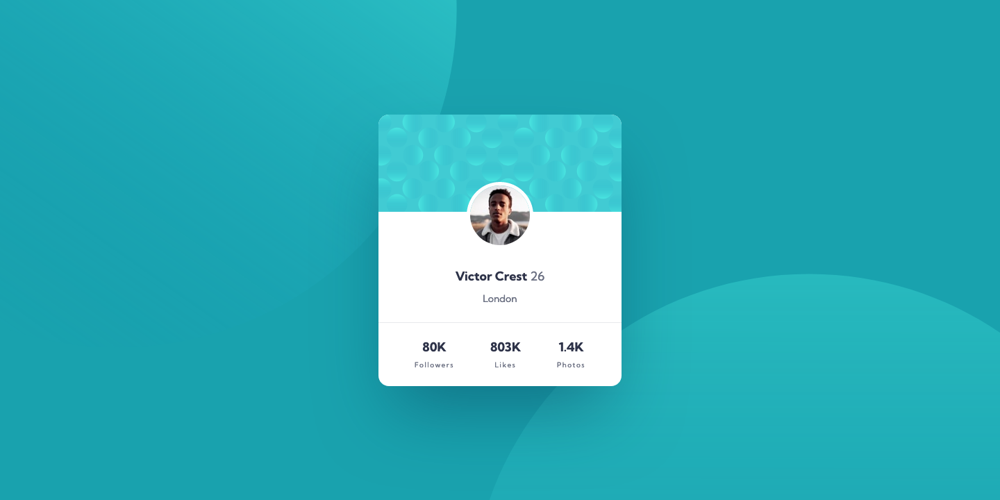

# Profile card component solution

This is a solution to the [Profile card component challenge on Frontend Mentor](https://www.frontendmentor.io/challenges/profile-card-component-cfArpWshJ).

## Table of contents

-   [Screenshot](#screenshot)
-   [Links](#links)
-   [Built with](#built-with)
-   [Author](#author)

## Screenshot

## Links

-   [Solution URL](https://github.com/ionStici/profile-card-component-main)
-   [Live Site URL](https://ionstici.github.io/profile-card-component-main)

## Built with

-   Semantic HTML5 markup
-   CSS custom properties
-   Flexbox
-   Mobile-first workflow

## Author

-   [GitHub](https://github.com/ionStici)
-   [Frontend Mentor](https://www.frontendmentor.io/profile/ionStici)
-   [Twitter](https://twitter.com/ionStici_)

<!-- Style Guide
Dark cyan: hsl(185, 75%, 39%)
Very dark desaturated blue: hsl(229, 23%, 23%)
Dark grayish blue: hsl(227, 10%, 46%)
Dark gray: hsl(0, 0%, 59%)

- Font size (name and stats): 18px
- Family: [Kumbh Sans](https://fonts.google.com/specimen/Kumbh+Sans)
- Weights: 400, 700 -->

<!-- Style Guide
Dark cyan: hsl(185, 75%, 39%)
Very dark desaturated blue: hsl(229, 23%, 23%)
Dark grayish blue: hsl(227, 10%, 46%)
Dark gray: hsl(0, 0%, 59%)

- Font size (name and stats): 18px
- Family: [Kumbh Sans](https://fonts.google.com/specimen/Kumbh+Sans)
- Weights: 400, 700 -->
